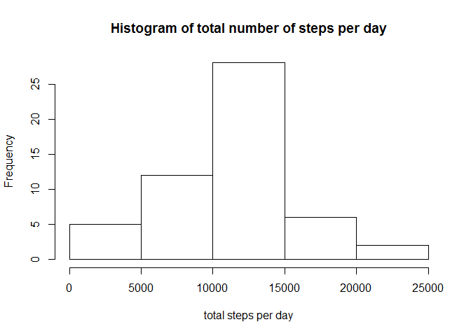
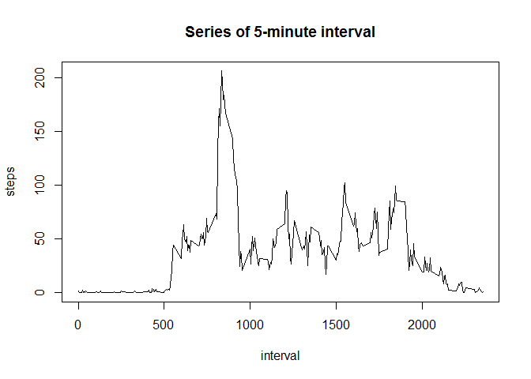
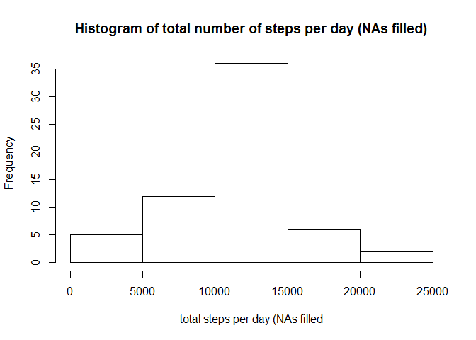
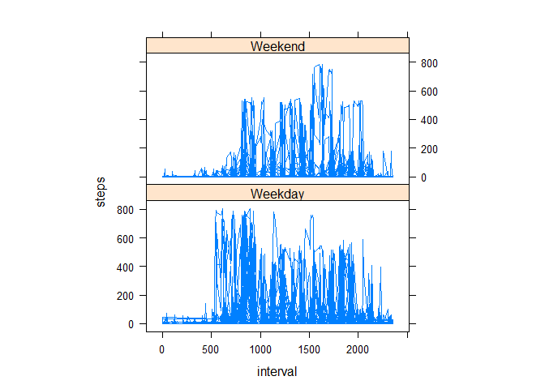

# Reproducible Research: Peer Assessment 1


## Loading and preprocessing the data

```r
# reading activity file
activity <- read.table(paste(getwd(),"/activity.csv", sep=""), sep=",", header=TRUE)
```


## What is mean total number of steps taken per day?

```r
# aggregate value
agg <- aggregate(steps ~ date, data = activity, sum)
# creating plot
hist(agg$steps , main="Histogram of total number of steps per day", xlab="total steps per day")
```

 

```r
# calculating values
mean(agg$steps, na.rm = TRUE)
```

```
## [1] 10766.19
```

```r
median(agg$steps, na.rm = TRUE)
```

```
## [1] 10765
```
Above are mean and median values.


## What is the average daily activity pattern?

```r
# aggregate value
agg2 <- aggregate(steps ~ interval, data = activity, mean)
## creating plot
plot(steps ~ interval, data = agg2, type = "l", main="Series of 5-minute interval")
```

 

```r
agg2[which.max(agg2$steps), ]$interval
```

```
## [1] 835
```
This is the interval.


## Imputing missing values

```r
# count complete values
nrow(activity[!complete.cases(activity),])
```

```
## [1] 2304
```

```r
## imputing values
newActivity <- activity

for (i in 1:nrow(newActivity)){
  
  if (!complete.cases(newActivity[i,]))
  {
    step <- agg2[agg2$interval==newActivity[i,"interval"], "steps"]
    newActivity[i,"steps"] <- step
  }
}

agg3 <- aggregate(steps ~ date, data = newActivity, sum)
hist(agg3$steps , main="Histogram of total number of steps per day (NAs filled)", xlab="total steps per day (NAs filled")
```

 

```r
mean(agg3$steps, na.rm = TRUE)
```

```
## [1] 10766.19
```

```r
median(agg3$steps, na.rm = TRUE)
```

```
## [1] 10766.19
```
The mean value is the same because I put the mean value for that interval. 
The median value is a little difference.

## Are there differences in activity patterns between weekdays and weekends?

```r
Sys.setlocale("LC_TIME", "English")
```

```
## [1] "English_United States.1252"
```

```r
for (i in 1:nrow(newActivity)){  
  
  if ((weekdays(as.Date(newActivity$date[i])) == "Saturday") ||
    (weekdays(as.Date(newActivity$date[i])) == "Sunday"))
    newActivity$weekType[i] <- "Weekend"
  else
    newActivity$weekType[i] <- "Weekday"  
  
}

library(lattice)
xyplot(steps ~ interval | factor(weekType), data = newActivity, aspect = 1/2, type = "l")
```

 
